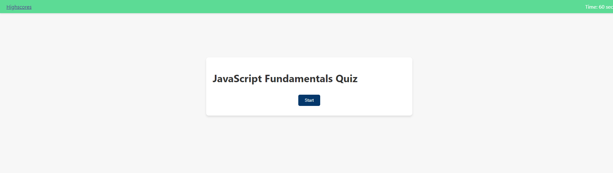

# Coding Quiz

## Features

- Interactive quiz application to test knowledge on JavaScript fundamentals.
- Dynamic question presentation with multiple-choice answers.
- Timer functionality that deducts time for incorrect answers and ends the quiz when time runs out.
- Ability to save high scores with user initials to track performance over time.
- Responsive design for an optimal user experience across various devices.

## Technologies Used

- HTML
- CSS
- JavaScript

## Getting Started

To view the project locally, follow these steps:

1. Clone the repository to your local machine using the command `git clone [https://github.com/Mpierson00/InterviewCodingPrep]`.
2. Navigate to the cloned directory.
3. Open the `index.html` file in your web browser to start the quiz.

## Contributing

Contributions to the Coding Quiz project are welcome! If you have suggestions or improvements, feel free to fork the repository and submit a pull request with your changes.

## Acknowledgments

- Thank you to all the contributors who have helped in refining and enhancing this project.
- Special thanks to the JavaScript and web development communities for their invaluable resources and support.

## License

MIT License 

Copyright (c) [2024] [Michael Pierson]

Permission is hereby granted, free of charge, to any person obtaining a copy
of this software and associated documentation files (the "Software"), to deal
in the Software without restriction, including without limitation the rights
to use, copy, modify, merge, publish, distribute, sublicense, and/or sell
copies of the Software, and to permit persons to whom the Software is
furnished to do so, subject to the following conditions:

The above copyright notice and this permission notice shall be included in all
copies or substantial portions of the Software.

THE SOFTWARE IS PROVIDED "AS IS", WITHOUT WARRANTY OF ANY KIND, EXPRESS OR
IMPLIED, INCLUDING BUT NOT LIMITED TO THE WARRANTIES OF MERCHANTABILITY,
FITNESS FOR A PARTICULAR PURPOSE AND NONINFRINGEMENT. IN NO EVENT SHALL THE
AUTHORS OR COPYRIGHT HOLDERS BE LIABLE FOR ANY CLAIM, DAMAGES OR OTHER
LIABILITY, WHETHER IN AN ACTION OF CONTRACT, TORT OR OTHERWISE, ARISING FROM,
OUT OF OR IN CONNECTION WITH THE SOFTWARE OR THE USE OR OTHER DEALINGS IN THE
SOFTWARE.